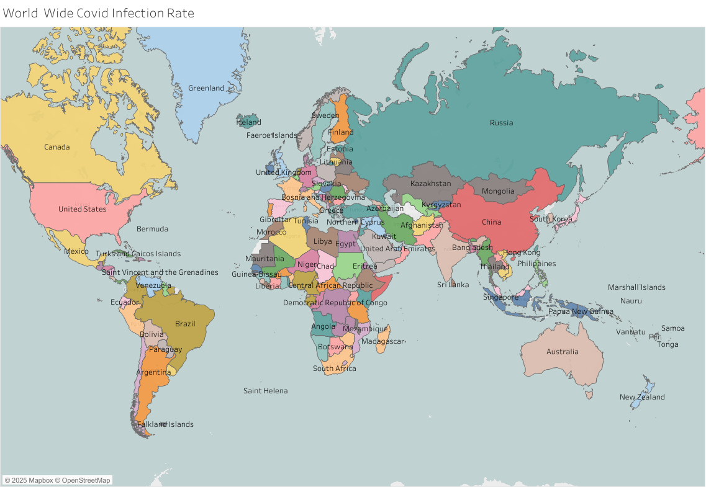

# Global COVID-19 Statistics Dashboard 

**Objective:**  
A global overview of COVID-19 cases, recoveries, and deaths with interactive filtering by country and region.

---

### Problem Statement / Objective
- Provide a **clear view of global pandemic trends**  
- Enable country-level comparisons of confirmed cases and mortality rates  
- Track and visualize **long-term trends and regional outbreaks**

---

### Process & Tools Used
1. **Data Preparation:**  
   - Sourced and cleaned global COVID-19 data (WHO & public datasets)  
   - Aggregated metrics by date and country

2. **Visualization (Tableau):**  
   - Built KPIs: total cases and percentage infected 
   - Created trend lines and regional maps for geographical distribution

3. **Interactivity & Presentation:**  
   
   - Designed layout for easy interpretation by a public health team

---

### Key Insights & Business Impact
- Enabled **quick comparison** of global and regional pandemic trends  
- Highlighted countries with **highest case spikes and mortality rates**  
- Supported **policy awareness** and community risk communication

---

### Full Dashboard  
🔗 [View Dashboard](https://public.tableau.com/views/global-stats-covid-data/Feuille3)
