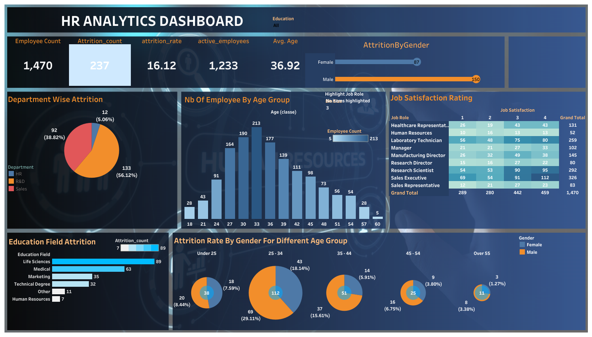

# HR Analytics Dashboard 

**Objective:**  
Provide HR leadership with **real-time workforce insights** on attrition, department performance, and gender diversity.

---

### Problem Statement / Objective
- Track workforce KPIs and attrition trends  
- Identify diversity gaps and department-level performance issues  
- Enable leadership to make **data-driven HR decisions**

---

### Process & Tools Used
1. **Data Preparation:**  
   - Cleaned and aggregated HR data in Excel  
   - Prepared KPIs for attrition, department, and gender

2. **Visualization (Tableau):**  
   - Created **interactive dashboard** with filters for department and roles  
   - Applied **visual hierarchy and color theory** for easy interpretation

3. **Interactivity & Presentation:**  
   - Added **filters & drill-downs** for ad-hoc exploration  
   - Published on Tableau Public for leadership review

---

### Key Insights & Business Impact
- Highlighted departments with **highest attrition rates**  
- Revealed **gender imbalance in key roles**  
- Centralized HR metrics to **improve strategic planning**

---

### Full Dashboard
🔗 [View Interactive Dashboard](https://public.tableau.com/views/hr_analysis_17208877845420/hranalysis_1)
