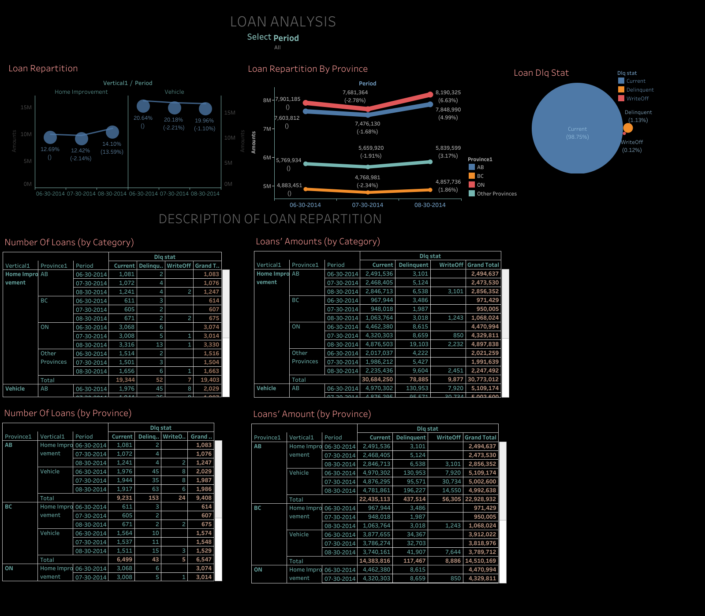

# Loan Analysis Dashboard 

**Objective:**  
Analyzed loan applications and repayment performance to **support credit risk assessment and portfolio optimization**.

---

### Problem Statement / Objective
- Monitor **loan approvals, rejections, and repayment performance**  
- Identify trends by **loan type, customer demographics, and default rates**  
- Support decision-making in credit risk and portfolio planning

---

### Process & Tools Used
1. **Data Preparation:**  
   - Cleaned and aggregated loan application and repayment data  
   - Segmented data by **loan type, status, and applicant profile**

2. **Visualization (Tableau):**  
    
   - Used bar charts, trend lines, and categorical breakdowns

3. **Interactivity & Presentation:**  
   - Added filters for **loan period**  
   - Published to Tableau Public with interactive exploration

---

### Key Insights & Business Impact
- Identified **high-default loan categories** to adjust risk strategy  
- Improved **portfolio monitoring and reporting** for finance teams  
- Enhanced transparency in **credit performance analysis**

---

### Full Dashboard
🔗 [View Interactive Dashboard](https://public.tableau.com/views/loan_analysis_3/Tableaudebord1)
