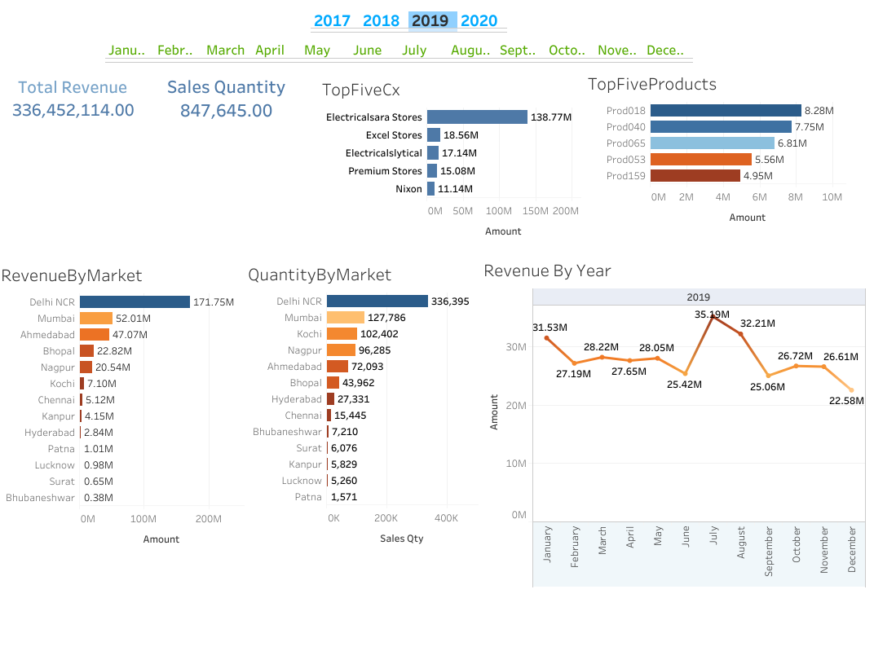

# Sales Insights Dashboard – Tableau

**Objective:**  
Interactive dashboard providing actionable sales performance insights across products, regions, and time periods.

---

### Problem Statement / Objective
- Identify top-performing products and regions  
- Monitor **monthly revenue trends and sales growth**  
- Highlight underperforming areas for strategic intervention

---

### Process & Tools Used
1. **Data Preparation:**  
   - Cleaned and aggregated sales transactions in Excel  
   - Generated product, region, and time-based summaries

2. **Visualization (Tableau):**  
   - Created KPIs for **total sales, revenue growth, and regional breakdowns**  
   - Designed bar charts, line trends, and heatmaps with drill-down filters

3. **Interactivity & Presentation:**  
   - Added **product, region, and date filters** for ad-hoc analysis  
   - Published to Tableau Public for stakeholder access

---

### Key Insights & Business Impact
- Identified **top 3 revenue-driving regions** and **best-selling product categories**  
- Detected seasonal sales patterns supporting better inventory planning  
- Helped leadership focus on underperforming regions for targeted campaigns

---

### Full Dashboard
🔗 [View Interactive Dashboard](https://public.tableau.com/views/sales_insights_17208884955170/Tableaudebord1)
