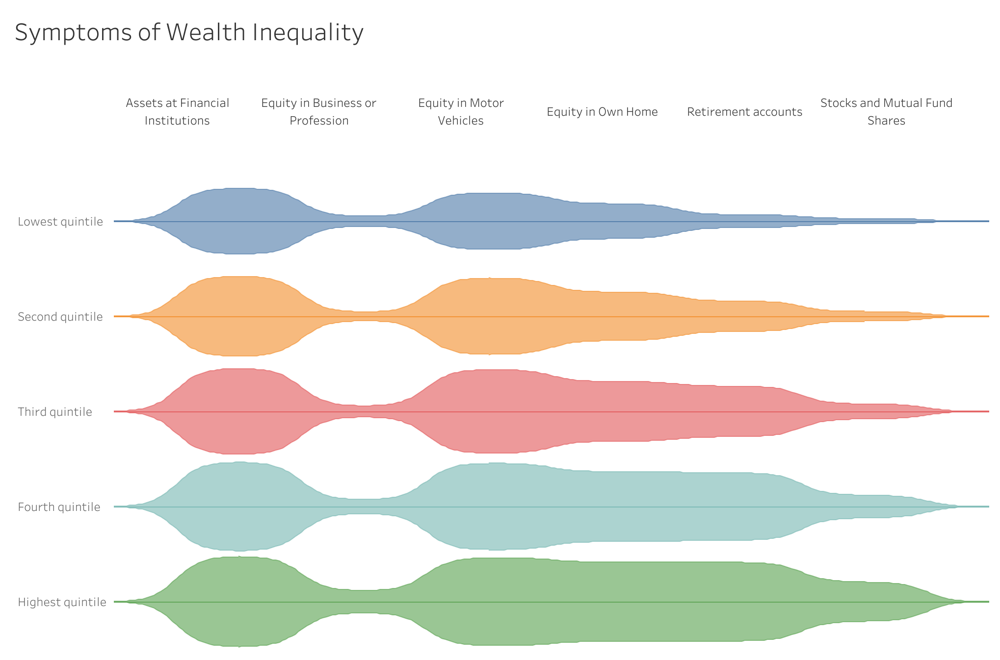

# 📉 Symptoms of Wealth Inequality — Tableau Dashboard

## 🎯 Objective
Visualize wealth inequality patterns across population groups to help policymakers, researchers, and analysts identify socioeconomic disparities.

## 🧩 Problem Statement / Objective
- Understand how income, education, and demographic factors vary across regions  
- Identify where wealth gaps are widening  
- Provide a clear storytelling dashboard to support data-driven decision-making  
- Enable users to explore inequality indicators interactively

## 🛠️ Process & Tools Used

### **Data Preparation**
- Cleaned, aggregated, and validated socioeconomic data (Excel / CSV)
- Standardized categorical values for regions, groups, and economic indicators
- Created calculated fields to normalize income and wealth metrics across population sizes

### **Visualization (Tableau)**
- Built multi-layered visuals showing income distribution, demographic disparities, and trend comparisons  
- Implemented:
  - Violin chart  
- Applied accessibility-aware color palette to improve interpretability

## 🔍 Key Insights & Business Impact
- Visualized how wealth inequality varies significantly across demographic groups  
- Highlighted regions with critical income gaps  
- Exposed correlations between education access and wealth outcomes  
- Enabled organizations to prioritize areas requiring intervention  
- Provides evidence-based guidance for social programs and policy development

---

## 📊 Full Dashboard  
🔗[View Interactive Dashboard](https://public.tableau.com/app/profile/franck.talla/viz/SymptomsofWealthInequality_17551125277080/SymptomsofWealthInequality)

