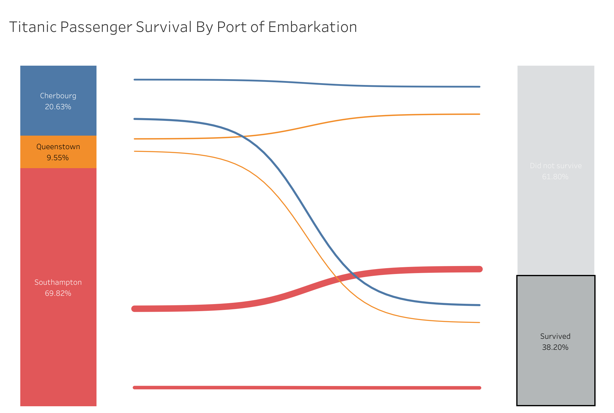

# 🚢 Titanic Passenger Survival by Port of Embarkation — Tableau Dashboard

## 🎯 Objective
Analyze Titanic survival outcomes by embarkation port to uncover demographic and socioeconomic patterns influencing survival rates.

## 🧩 Problem Statement / Objective
- Understand survival patterns across passenger classes, gender, and ages  
- Identify whether the port of embarkation influenced survival likelihood  
- Provide an interactive dashboard for historical and analytical exploration  

## 🛠️ Process & Tools Used

### **Data Preparation**
- Cleaned Titanic passenger manifest (CSV)  
- Imputed missing age values  
- Classified passengers into demographic buckets  
- Engineered survival indicators for clarity

### **Visualization (Tableau)**
- Created a survival distribution comparison by **port: C (Cherbourg), Q (Queenstown), S (Southampton)**  
- Built:
  - Stacked bar charts  
  - Class breakdowns  
- Implemented intuitive color coding to differentiate survival status

### **Interactivity & Presentation** 
- Hover tooltips revealing passenger count  
- Drill-down into passenger sub-groups  

## 📊 Full Dashboard  
🔗 [View Interactive Dashboard](https://public.tableau.com/app/profile/franck.talla/viz/TitanicPassengerSurvivalByPortofEmbarkation/TitanicPassengerSurvivalByPortofEmbarkation)
