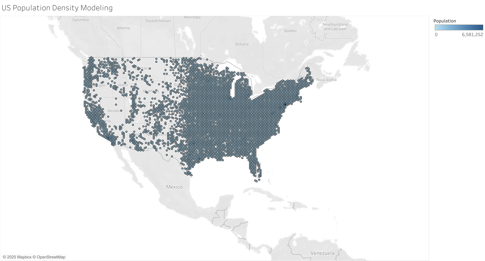

# 🗺️ US Population Density Modeling — Tableau Dashboard

## 🎯 Objective
Model and visualize population density across U.S. states and regions for demographic analysis and strategic planning.

## 🧩 Problem Statement / Objective
- Represent U.S. population distribution clearly  
- Identify high-density and low-density regions  
- Support demographic research, business expansion, and urban planning decisions  

## 🛠️ Process & Tools Used

### **Data Preparation**
- Cleaned census/geo-demographic dataset  
- Standardized FIPS/state codes  
- Created calculated fields for population per square mile  
- Aggregated population by geographic region  
- Validated geographic joins for choropleth mapping

### **Visualization (Tableau)**
- Built a **geographical heatmap (choropleth)** showing population density  
- Added regional comparison views  
- Implemented visual hierarchy to emphasize high-density regions  
- Used color scaling to differentiate density intensities  
 

## 🔍 Key Insights & Business Impact
- Identified states with extremely high population density (e.g., NJ, MA)  
- Highlighted sparsely populated regions in the Midwest & Mountain West  
- Supports:
  - Government planning  
  - Business expansion strategy  
  - Infrastructure prioritization  
- Provides a clear spatial understanding of population distribution across the U.S.

## 📊 Full Dashboard  
🔗[View Interactive Dashboard](
https://public.tableau.com/app/profile/franck.talla/viz/USPopulationDensityModeling_17557905520120/USPopulationDensityModeling)
