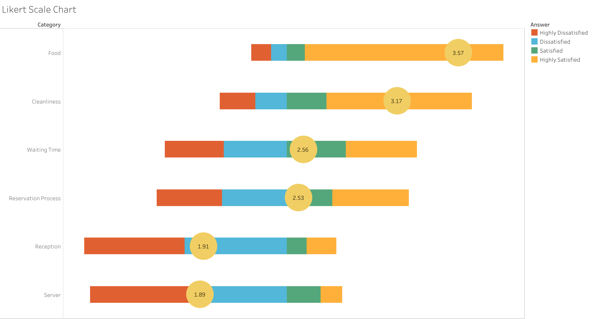

# ⭐ Restaurant Survey Analysis — Tableau Dashboard

## 🎯 Objective
Provide restaurant management with a clear, data-driven view of customer satisfaction to identify service improvements and enhance customer experience.

---

## 🧩 Problem Statement / Objective
- Analyze restaurant survey responses using Likert scale ratings  
- Identify strengths and weaknesses across service categories  
- Support management in prioritizing customer-centric changes  

---

## 🛠️ Process & Tools Used

### **Data Preparation**
- Cleaned raw survey responses  
- Standardized Likert scale scores (Strongly Disagree → Strongly Agree)
- Aggregated customer ratings by category (Service, Food, Cleanliness, Ambience)
- Validated data completeness & consistency

### **Visualization (Tableau)**
- Designed a Likert-style bar visualization for intuitive interpretation  
- Built comparison charts showing satisfaction distribution  
- Added sentiment-based color scaling to highlight negative vs positive experiences

### **Interactivity & Presentation**
- Filters for demographic groups or visit frequency  
- Detailed tooltips summarizing average score per attribute  
- Drill-down into survey categories for deeper diagnostics  
- Dashboard published on Tableau Public

---

## 🔍 Key Insights & Business Impact
- Identified service categories with the lowest satisfaction  
- Highlighted strong performance in food quality but lower ratings in service speed  
- Revealed cleanliness as a key driver of overall satisfaction  
- Equipped management with clear areas for training and operational improvements

---

## 📊 Full Dashboard  
🔗[View Interactive Dashboard](https://public.tableau.com/app/profile/franck.talla/viz/RestaurantSurveyAnalysis_17558813988590/LikertScaleChart)
